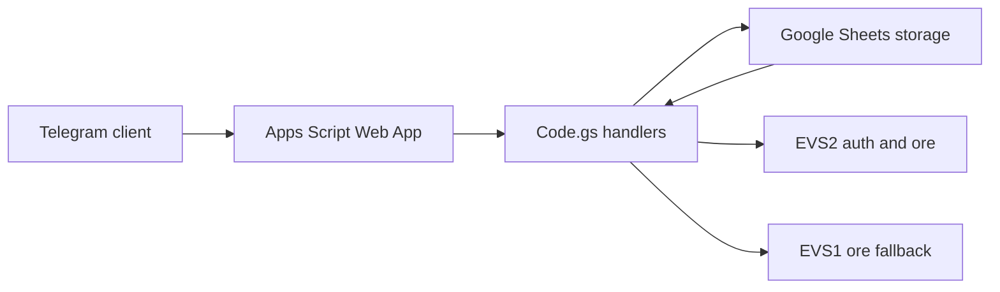
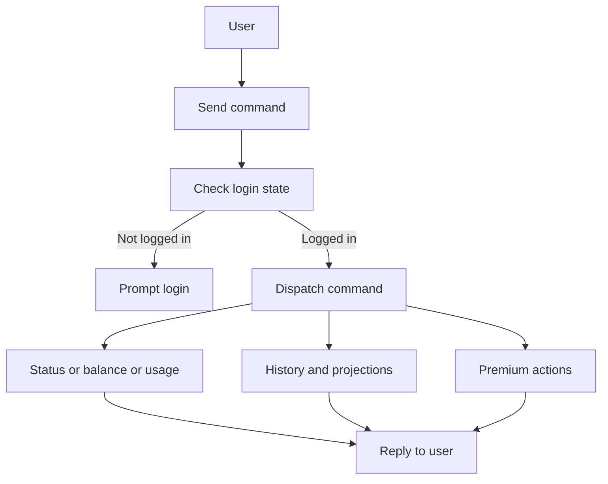
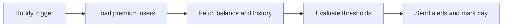
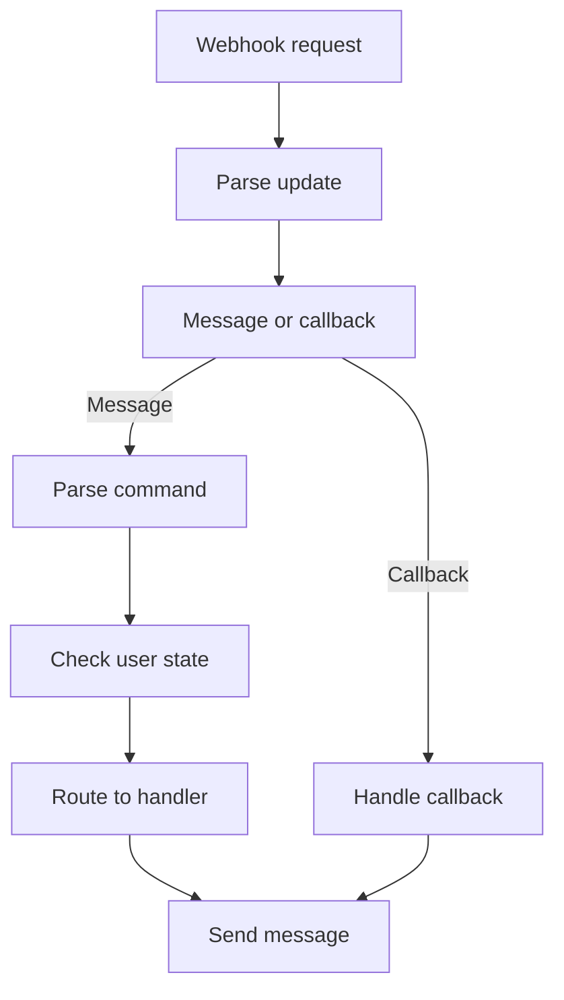

# EVS Telegram Bot for Google Apps Script

Telegram bot that logs into EVS, shows meter info, balance, usage, and supports premium features like notifications and balance logging. Premium features are features that require an upgrade code to unlock, because they rely on more expensive automated data fetching and storage. 

With this repo, you can deploy your own bot using Google Apps Script and Google Sheets for storage, giving you access to premium features and full data ownership.

This app does not require any external services beyond Google and EVS, and all code is open source. It only relies on free-tier Google Apps Script and Telegram Bots. 

## Setup
1. Create a Google Sheet and open Extensions -> Apps Script.
2. Paste `Code.gs` into the Apps Script project or use this repo as a clasp project.
3. In Apps Script, open Project Settings and add Script Properties:
   - `TELEGRAM_BOT_TOKEN` required bot token
   - `TELEGRAM_WEBHOOK_URL` optional explicit webhook URL
   - `TELEGRAM_ALLOWED_UPDATES` optional JSON list of Telegram update types
   - `TELEGRAM_AUTO_WEBHOOK` optional true to auto set webhook in `entryPoint`
   - `TELEGRAM_UPGRADE_CODE*` optional premium codes, use suffixes for multiple codes
   - `TELEGRAM_UPGRADE_CODE_AUTO_GRANT` optional label for auto‑grant upgrades
   - `AUTO_GRANT_PREMIUM` optional `1` to enable auto‑grant premium
   - `AUTO_GRANT_MAX` optional max number of auto‑grant premium licenses
   - `EVS_CARBON_KG_PER_KWH` optional carbon factor for leaderboard calculations
   - `EVS_TEST_USERNAME` optional test username used by `entryPoint`
   - `EVS_TEST_PASSWORD` optional test password used by `entryPoint`
   - `TELEGRAM_LAST_UPDATE_ID` set automatically to dedupe updates
4. Save the project.
5. Run `entryPoint` once to validate configuration and log webhook and EVS checks.
6. Deploy as Web app execute as Me, access Anyone. The webhook URL is only available after deployment.
7. Run `setWebhook` or `setWebhookAuto` once to register the webhook.
8. Create triggers:
   - Hourly trigger for `automationsHourly`
   - Optional daily trigger for `automationsDaily` if you add daily jobs later
9. In Telegram, send `/login` to start.

## Commands
- `/login` prompts for EVS username and password
- `/status` meter info, balance, usage, projections
- `/balance` alias for `/status`
- `/usage` alias for `/status`
- `/myinfo` meter details and location
- `/history [days]` daily usage history
- `/leaderboard` recent usage rank snapshots
- `/data [days]` premium only balance log view
- `/notify` premium only notification settings
- `/upgrade <code>` unlock premium features
- `/join_waitlist` join premium waitlist
- `/leave_waitlist` leave premium waitlist
- `/suggest <text>` send feedback to the suggestions sheet
- `/logout` unlink EVS account
- `/help` list commands

## Notes
- Credentials are stored in the `users` sheet. Keep the sheet private.
- Logs are stored in the `logs` sheet.
- Premium balance logs are stored in `account_balances` and upserted once per SGT day.
- Suggestions are stored in the `suggestions` sheet.
- Usage history values are currently fetched with `convert_to_money: "true"` (currency, not kWh).
- EVS2 endpoints are used by default with a fallback to EVS1 credit balance where needed.
- See `EVS_API.md` for endpoint details and payload shapes.

## Auto‑Grant Premium
Optional auto‑grant can give free premium access to the first N users who message the bot.
- Enable with `AUTO_GRANT_PREMIUM=1`
- Cap with `AUTO_GRANT_MAX`
- Optional label with `TELEGRAM_UPGRADE_CODE_AUTO_GRANT`

When auto‑grant triggers, the user is notified with their license number out of the total cap.

## API Notes
Newer endpoints used in the bot:
- `get_month_to_date_usage` (usage)
- `get_history` (daily history + runout projections)
- `cp/get_recent_usage_stat` (leaderboard + rank snapshots)

## Architecture
High level components and the main integration points between Telegram, Apps Script, Sheets, and EVS services.

## User Flow
User interaction path from initial message through authentication, routing, and response generation.

## Notification System
Notification types include low balance alerts and runout projection alerts. Options are configured with `/notify`:
- `/notify on` or `/notify off` to toggle all notifications
- `/notify low <amount>` to set low balance threshold, `/notify low off` to clear it
- `/notify runout <days-left> [7,14,30]` to set runout threshold and windows, `/notify runout off` to clear it

Notifications run hourly, but are only sent once per SGT day per type using stored last alert dates.

## Message Handling
Webhook update parsing and routing for both messages and callback actions.

